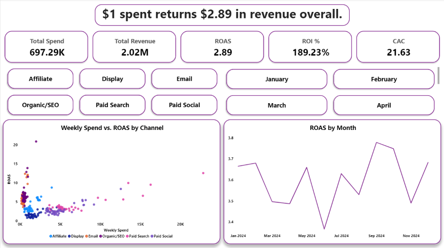
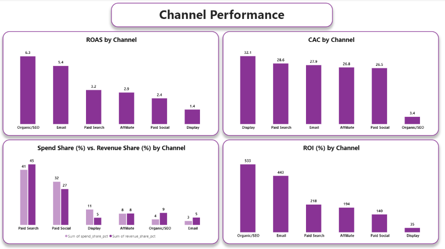
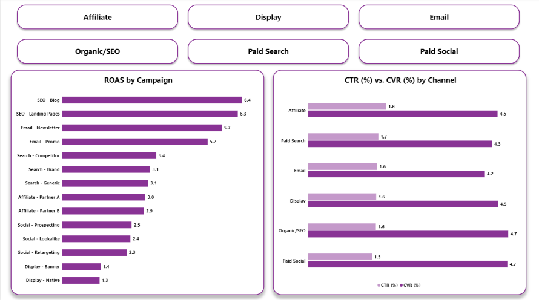

<h1 align="center">ROAS & ROI Analysis</h1>

## Background and Overview

Marketing budgets are only as good as the return they generate, but "which channels are actually worth the spend" is a surprisingly easy question to get wrong — a channel can look strong on ROAS while quietly having a worse funnel, or look weak overall while a handful of its campaigns are outperforming everything else. This project evaluates marketing return using a **fully synthetic marketing dataset**, generated specifically for this analysis and independent of any other dataset used elsewhere in this portfolio.

The analysis was built to answer four questions a marketing or growth team would ask directly:
- Overall, is the marketing spend profitable — and by how much?
- Which channels and campaigns generate the best return, and which are underperforming?
- Is spend efficiency holding steady over time, or are channels showing diminishing returns as more is invested?
- When a channel underperforms, is it because of a weak funnel (low click-through or conversion) or because it costs more to acquire each customer?

## Data Structure Overview

The dataset is a single flat table, `roas_roi_synthetic_data.csv` (742 rows, 10 columns), loaded into DuckDB and queried via `roas_roi.sql`. Each row represents one campaign's performance for a given week:

| Field | Type | Description |
|---|---|---|
| week_start_date | DATE | Week the row covers (56 unique weeks) |
| channel | VARCHAR | Marketing channel (6 unique: e.g., Paid Search, Organic/SEO, Email) |
| campaign | VARCHAR | Specific campaign within a channel (15 unique) |
| impressions | BIGINT | Ad impressions served that week |
| clicks | BIGINT | Clicks that week |
| conversions | BIGINT | Conversions that week |
| spend | DOUBLE | Marketing spend for that campaign-week |
| revenue | DOUBLE | Revenue attributed to that campaign-week |
| roas | DOUBLE | Pre-calculated ROAS for that row |
| roi_pct | DOUBLE | Pre-calculated ROI (%) for that row |

Because this is a single flat, pre-aggregated synthetic table, no joins or data-cleaning stage were required. The SQL work centers on rolling these campaign-week rows up to overall, channel, and campaign-level summaries, plus monthly/weekly trend views — and on deriving CTR (clicks/impressions) and conversion rate (conversions/clicks) from the raw funnel counts rather than reading them off a pre-built column.

## Executive Summary

**Every $1 spent returns $2.89 in revenue overall** (blended ROAS 2.89, ROI 189%, CAC $21.63) — marketing spend is solidly profitable in aggregate.

**Channel performance varies more than 4x.** Organic/SEO (6.3 ROAS) and Email (5.4 ROAS) are the strongest performers, while Display (1.4 ROAS) lags well behind the rest. This gap isn't a funnel problem — **click-through and conversion rates are nearly identical across every channel** (CTR clustered at 1.5–1.8%, conversion rate at 4.2–4.7%). The real driver is cost: **CAC ranges from $3.40 (Organic/SEO) to $32.10 (Display)**, a nearly 10x spread, meaning the gap in return comes from what it costs to acquire a customer, not how well the funnel converts once someone's in it.

**No diminishing returns were found.** Weekly spend and ROAS show essentially zero correlation — high-spend weeks aren't systematically less efficient than low-spend weeks — suggesting the top channels have room to absorb more budget without an automatic drop in return.

## Insights Deep Dive

- **Overall health check: blended ROAS of 2.89, ROI of 189%, and CAC of $21.63** establish that marketing spend is profitable in aggregate before breaking anything down further — the necessary baseline before channel- or campaign-level claims mean anything.

- **Channel-level ROAS ranges from 1.4 (Display) to 6.3 (Organic/SEO)** — a more than 4x spread. Paid Search and Paid Social together account for the majority of spend share (41% and 32% respectively) but their revenue share doesn't outpace that proportionally, while Organic/SEO punches well above its spend share (4% of spend, 9% of revenue).

- **CAC — not funnel quality — explains the channel gap.** CTR and conversion rate are nearly uniform across all six channels (roughly 1.5–1.8% CTR, 4.2–4.7% conversion rate), which rules out "some channels convert visitors better than others" as the explanation. CAC tells the real story instead: Organic/SEO's $3.40 CAC versus Display's $32.10 is close to a 10x difference, and that gap — not funnel performance — is what separates the best and worst channels.

- **Campaign-level drill-down confirms the pattern holds within channels, not just between them.** SEO - Blog (6.4 ROAS) and SEO - Landing Pages (6.3) lead every campaign in the dataset, while Display - Banner (1.4) and Display - Native (1.3) sit at the bottom — meaning Display's weak performance isn't one bad campaign dragging down an average, it's consistent across the whole channel.

- **No evidence of diminishing returns.** The weekly spend-vs-ROAS relationship shows essentially zero correlation — ROAS doesn't systematically drop as weekly spend increases within the observed range. This is a meaningful finding on its own: it means current underinvestment in top channels isn't being self-corrected by rising costs, and there's no signal (yet) that scaling budget in Organic/SEO or Email would erode their return.

## Recommendations

- **Shift incremental budget toward Organic/SEO and Email, and away from Display.** With no evidence of diminishing returns and CAC — not funnel quality — driving the performance gap, the case for reallocating spend toward the cheapest-to-acquire channels is strong. *(Ties to: channel-level ROAS/CAC.)*

- **Treat Display as a channel to fix or scale back, not scale up.** It has the lowest ROAS, highest CAC, and lowest ROI of any channel, and its weakness holds across both of its campaigns rather than being isolated to one. Before increasing spend here, the underlying acquisition cost needs to come down. *(Ties to: campaign-level drill-down.)*

- **Don't prioritize funnel/landing-page optimization as the lever for closing the channel gap.** Since CTR and conversion rate are nearly uniform across channels, effort spent trying to out-convert Display's audience is unlikely to close the gap — the fix is on the acquisition-cost side, not the funnel side. *(Ties to: CTR/CVR by channel.)*

- **Double down on the top campaigns specifically** — SEO - Blog, SEO - Landing Pages, and Email - Newsletter are the clear standouts (ROAS 5.7–6.4) and are good candidates for increased investment or as templates for what to replicate in weaker campaigns. *(Ties to: campaign-level drill-down.)*

- **Use the flat spend-vs-ROAS relationship to justify a controlled budget test** — since there's no visible ceiling yet in this data, a deliberate incremental spend increase in Organic/SEO or Email (with monitoring) would help find where diminishing returns actually begin, rather than assuming none exists. *(Ties to: weekly spend-vs-ROAS trend.)*

## Caveats and Assumptions

- **This dataset is fully synthetic**, generated specifically for this project rather than sourced from a real marketing account. Findings demonstrate the analytical approach — reallocating budget toward "Organic/SEO" in this dataset isn't a claim about real-world SEO economics.
- **Attribution is simplified.** Revenue in this dataset is attributed directly to a single channel/campaign per row, with no multi-touch or cross-channel attribution modeling. In reality, a purchase often follows exposure to several channels, which this analysis doesn't disentangle.
- **"No diminishing returns" reflects the spend range actually observed in the data**, not spend levels beyond it — it's not safe to assume ROAS would hold at, say, 5x or 10x the current budget for any channel.
- **CTR and conversion rate uniformity was observed across a limited number of channels (six).** With more channels or more granular audience segments, funnel differences might reappear even though they're invisible at this level of aggregation.